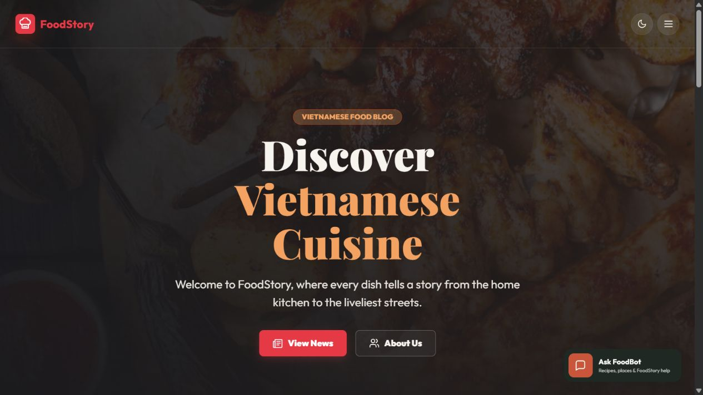
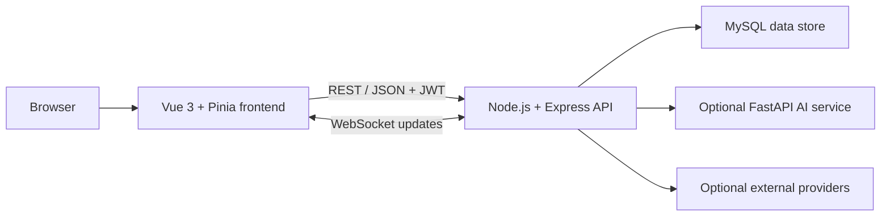

# FoodStory

FoodStory is a full-stack food discovery platform that combines recipe browsing, community contributions, a location-based Food Map, food news, and an evidence-aware assistant. It was built as a university project and developed into a deployable Vue, Express, and MySQL application.

[Hosted frontend](https://foodstory-cos30043-hoanglong212.onrender.com) · [API health](https://foodstory-api-cos30043-hoanglong212.onrender.com/api/health) · [GitHub repository](https://github.com/hoanglong212/foodstory)

> The public demo uses free-tier services. The static site loads immediately, while backend-dependent pages can take about a minute to wake. If the API remains unavailable, the external demo database may need to be restarted.

## Preview



Additional recruiter-ready captures and the demo-video link can be added using the checklist in [`docs/assets/screenshots/README.md`](docs/assets/screenshots/README.md).

## What the application does

- Browse, search, filter, and inspect recipes with ingredients, instructions, nutrition, ratings, and comments.
- Register and sign in to save favourites, maintain ingredient checklists, submit recipes, and manage a personal profile.
- Explore restaurants and community food spots on an interactive Leaflet map.
- Submit food places through a review-first workflow; uncertain visual or social evidence is not published as a verified place automatically.
- Read seeded food news with optional Guardian API enrichment.
- Ask FoodBot about FoodStory data, recipes, and places through deterministic routing, database retrieval, and optional model-provider fallbacks.
- Moderate users, recipes, comments, and submissions through role-protected admin workflows.

Provider-backed AI, OCR, geocoding, and news features are optional. The core recipe, account, and map data flows remain separate from those integrations.

## Architecture



| Layer | Responsibility |
|---|---|
| `frontend/` | Vue views, routing, Pinia state, responsive UI, API clients, Leaflet map, and frontend tests |
| `backend/` | Express routes, validation, authentication, authorization, domain services, MySQL access, WebSocket server, migrations, seeds, and backend tests |
| `ai-service/` | Optional FastAPI boundary for authenticated, rate-limited embedding/image capabilities |
| `backend/database/` | Relational schema, idempotent production bootstrap, migrations, seed catalogues, and data audits |
| `render.yaml` | Render Blueprint for the static frontend, Express API, and optional AI service |

The MySQL schema models users, recipes, ingredients, categories, tags, comments, favourites, ratings, checklists, food spots, and restaurants. Foreign keys preserve ownership and recipe relationships, with cascading cleanup on dependent records where appropriate.

## Authentication and security

- Passwords are hashed with bcrypt before storage.
- Login returns a signed JWT; protected API routes re-check the current user and ban status.
- Admin routes require both authentication and the `admin` role.
- Helmet, bounded JSON bodies, CORS allow-listing, API/auth rate limits, upload type checks, and URL-safety guards protect public boundaries.
- Secrets are loaded from service-specific environment files. Real `.env` files, credentials, local databases, uploads, and generated output are ignored by Git.

This is a portfolio/student deployment, not a production identity platform. Refresh tokens, password reset, email verification, managed secrets rotation, and a formal security review remain future hardening work.

## Technology

| Area | Tools |
|---|---|
| Frontend | Vue 3, Vite, Pinia, Vue Router, Axios, Bootstrap, Leaflet, Chart.js, Vitest |
| Backend | Node.js, Express, MySQL2, JWT, bcryptjs, Zod, Multer, WebSocket, Node test runner |
| Optional AI and discovery | FastAPI, Groq, Gemini, Google Vision, Geoapify, Tesseract, Guardian API |
| Deployment | Render Blueprint, Docker, external hosted MySQL with TLS |

## Local setup

### Prerequisites

- Node.js 20.19+ (Node 24 was used for the latest verification)
- npm
- MySQL 8+
- Python 3.11+ only if the optional AI service is required

### 1. Install dependencies

```bash
npm ci
npm ci --prefix backend
npm ci --prefix frontend
```

### 2. Configure the services

Copy the examples without committing the resulting files:

```powershell
Copy-Item backend/.env.example backend/.env
Copy-Item frontend/.env.example frontend/.env
Copy-Item ai-service/.env.example ai-service/.env
```

At minimum, configure the backend database values and a long random `JWT_SECRET`. The frontend defaults target `http://localhost:3000/api` and `ws://localhost:3000`.

External provider keys are optional. Keep them in `backend/.env` or the deployment dashboard, never in frontend variables or source files.

### 3. Create the database

Create a MySQL database named `foodstory`, then execute `backend/database/schema.sql`. For an existing database, use the repository migration scripts instead of resetting data:

```bash
npm run migrate --prefix backend
```

Production uses `npm run start:production --prefix backend`, which runs the idempotent bootstrap before starting the API.

### 4. Run the application

```bash
npm run dev
```

- Frontend: `http://localhost:5173`
- API: `http://localhost:3000/api`
- API health: `http://localhost:3000/api/health`

To run the optional AI service:

```powershell
python -m venv ai-service/.venv
ai-service/.venv/Scripts/python -m pip install -r ai-service/requirements.txt
ai-service/.venv/Scripts/python -m uvicorn main:app --app-dir ai-service --reload --port 8000
```

## Tests and build

Run the portfolio verification from the repository root:

```bash
npm run test:backend
npm run test:frontend
npm run build
```

Latest verified result on 23 August 2026:

| Check | Result |
|---|---|
| Backend automated tests | 411 passed |
| Frontend automated tests | 48 passed across 13 files |
| Frontend production build | Passed |
| Production dependency audit | 0 known vulnerabilities in backend and frontend |

The automated suites use fakes and injected providers for deterministic external-service coverage. A passing suite does not claim that optional provider quotas or the hosted database are currently available.

## Deployment

`render.yaml` defines three services:

1. Vue static frontend
2. Docker-based Express API
3. Optional Python AI service

Secrets stay in Render environment variables. The API accepts a TLS MySQL `DATABASE_URL`, and the frontend receives only public API/WebSocket URLs. See [`docs/DEPLOY_RENDER.md`](docs/DEPLOY_RENDER.md) for the deployment and health-check procedure.

**Current hosted status (23 August 2026):** the frontend, API, and hosted MySQL dependency are live.
The API health endpoint returned HTTP 200 with `database: connected`, and the recipes endpoint
returned HTTP 200 after the Aiven free service was restarted.

## My contribution

Repository history attributes the implementation to my `hoanglong212` / `HoangLong212` Git identities. My work spans:

- Vue application structure, recipe discovery, account flows, admin views, and the interactive Food Map
- Express REST APIs, MySQL schema/migrations, authentication, authorization, and deployment configuration
- FoodBot routing and evidence-aware external-provider boundaries
- Automated backend/frontend tests, security-focused regressions, and Render deployment recovery

I describe optional AI features as integrations and guarded fallbacks, not as a custom foundation model or a guaranteed always-online service.

## Demo links

| Resource | Link or status |
|---|---|
| Hosted frontend | [Open FoodStory](https://foodstory-cos30043-hoanglong212.onrender.com) |
| API health | [Check backend and database status](https://foodstory-api-cos30043-hoanglong212.onrender.com/api/health) |
| Demo video | Add the final 60–90 second walkthrough before sending applications |
| Source | [github.com/hoanglong212/foodstory](https://github.com/hoanglong212/foodstory) |

## Known limitations

- Free-tier services can cold-start, and the external MySQL demo service can be unavailable independently of the frontend.
- Payment, e-commerce, and real-time delivery workflows are outside this project’s scope.
- External news, model, OCR, and geocoding results depend on separately configured providers and quotas.
- Vision-assisted place discovery remains review-first and can return `not found` or `needs review` instead of inventing a match.
- The repository does not currently declare an open-source licence.
