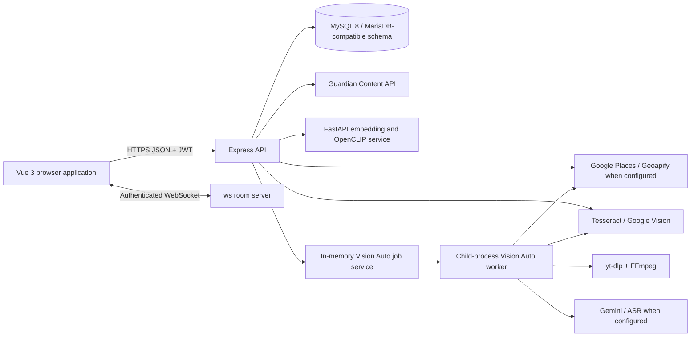
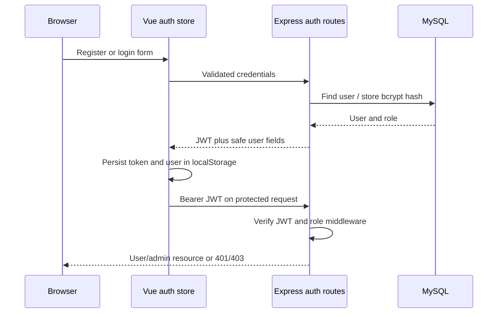
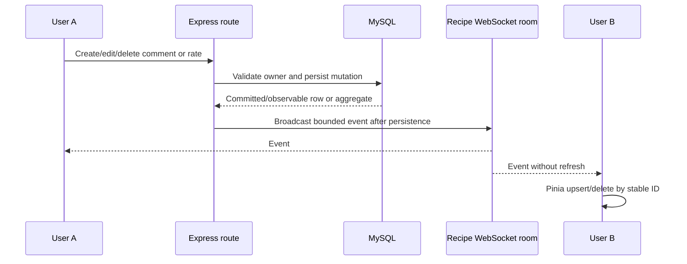
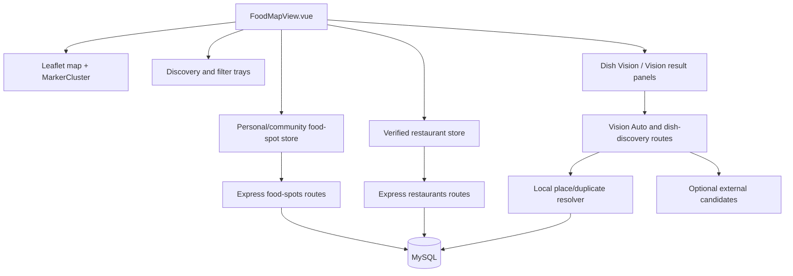
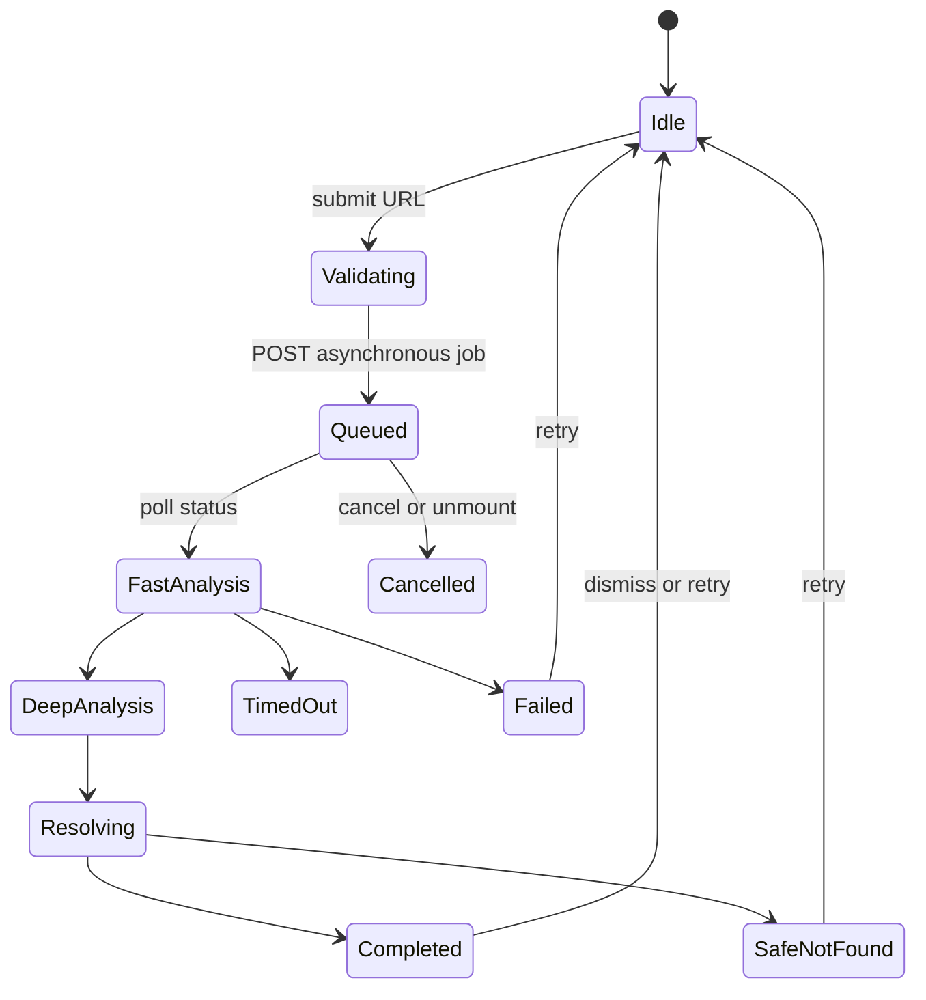
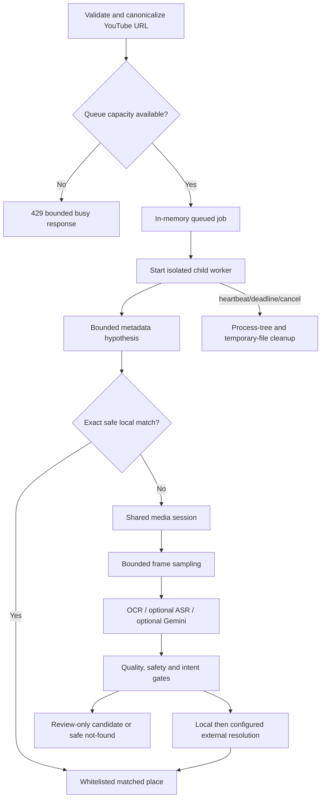
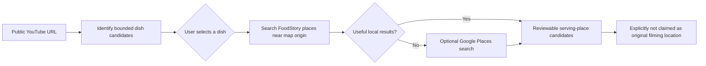

# FoodStory Architecture Summary

## Overall full-stack architecture

## Authentication and role flow

## Real-time comments and ratings

The UI stores de-duplicate comments by ID, while the database enforces one rating per `(user_id, recipe_id)`. Comment update/delete routes require the authenticated owner.

## Food Map architecture

## Vision Auto frontend job flow

`useVisionAuto` uses an abort controller, active job ID, polling terminal-state allowlist, elapsed timer, stale-run guard and unmount cleanup. Dish-first discovery is a related two-step flow rather than proof of a filming location.

## Vision Auto backend worker flow

## Dish-first discovery flow

